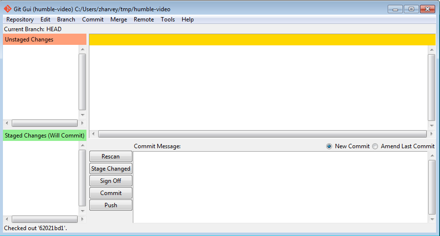

# Creating your own workspace

Now that you have the copy of the mod files, you can start working on it right now. 

While you can edit the files already, it is recommended that you create your own workspace or in Git's terms, branch; so that the changes between you and your teammates won't be in conflict.

**Step 1**. Fire up ``Git Gui`` if it isn't running.

**Step 2**. On the upper side of the window, click `Branch` then click `Create`. A new window will appear. Enter a branch name, better yet if you name to it yourself; then leave everything as is, then click `Create`.

**Step 3**. Then click `Branch` again on the upper side of the window, then now click, `Checkout`. A new different window will appear, select your branch, the one that you named; then click `Checkout`.

**You have now created your own Git branch and have switched to it. If you need to switch back to the main branch the process is the same from Step 3.**

*The main branch is the default branch that is primarily used in unifying the other branches.*