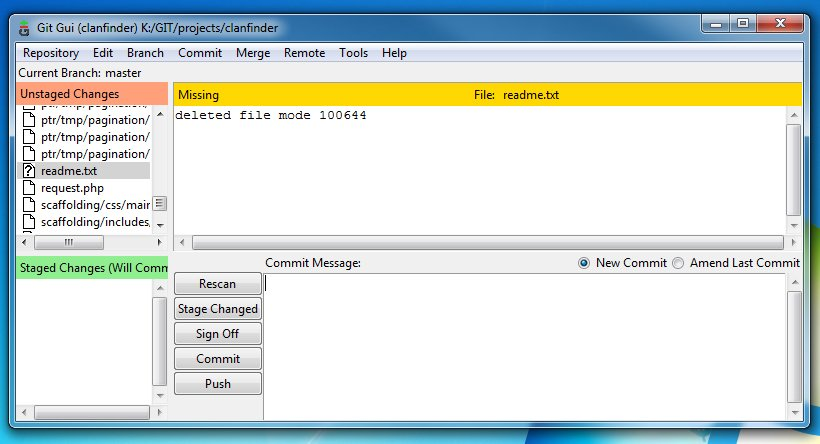
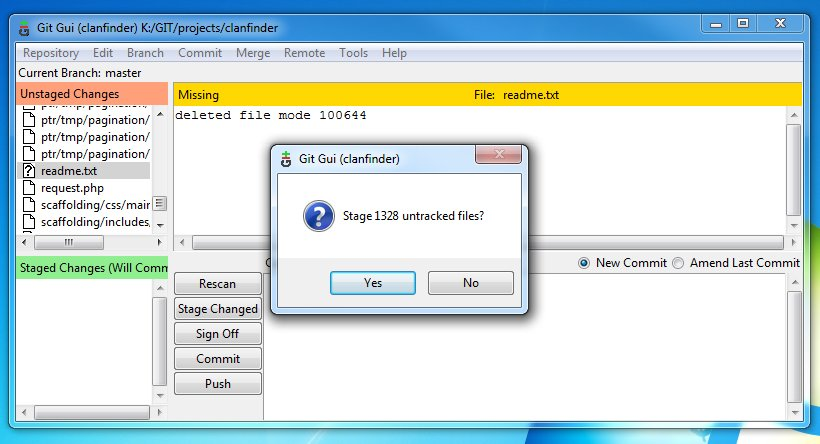
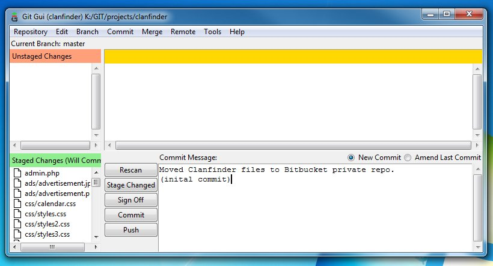

# Saving your changes

So you have added your changes to the mod files; now what? You'll need to `Commit` them so that your changes will be easily reversable and trackable in case something happens.

**Step 1**. Open up `Git Gui`. On the left side, you can see the changes you have made on the repository or the mod files. Click `Stage Changed` button so that the change will be included in the commit.

**Step 2**. Click `Yes`.

**Step 3**. On the bottom part of the window, enter a `Commit Message` on the textbox. Go fancy if you want to include line breaks in your messages. `Commit Messages` are necessary to inform your teammates what changes are included in your commit. When you are done, click the `Commit` button.