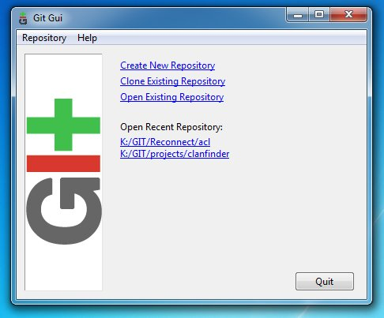
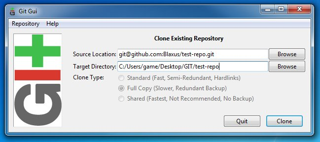
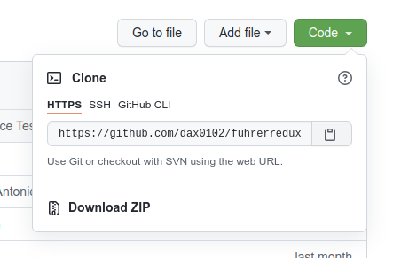

# Getting the mod files

## Procedure

**Step 1**. Open up `Git Gui` and you will be shown with a couple of options, choose the one that says, `Clone Existing Repository`.

**Step 2**. A new window will open, asking for a `Source Location` and a `Target Directory`. The `Source Location` is where the mod files are located. We will use the mod **Fuhrerredux** as a sample.

**Step 3**. Open any web browser then go to the mod github repository, in our case it will be [``https://github.com/dax0102/fuhrerredux-mod``](https://github.com/dax0102/fuhrerredux-mod). Click the `Code` button then click the clipboard button. Paste it into the `Source Location` in Git Gui.

**Step 4**. Click `Clone` then wait for the process to finish. Congratulations, you just made your first Git operation. Note that this process is rarely used.