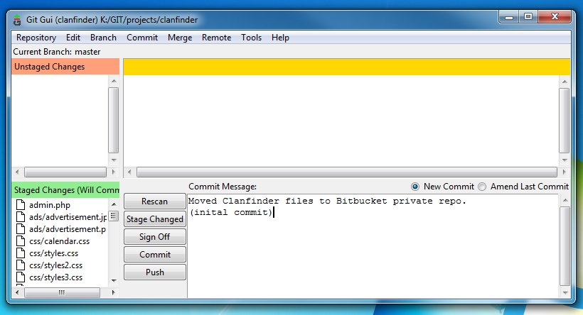

# Publishing your changes

You have saved or commited your changes in the repository, and you want to publish the commit to GitHub.

**Step 1**. Click the `Push` button on `Git Gui`.

**Step 2**. A new window will appear, select what branch you will push then click the button that is named `Push`.

**Step 3**. If Git needs your credentials to GitHub, then enter your username and password. Wait for it to finish then you are done.